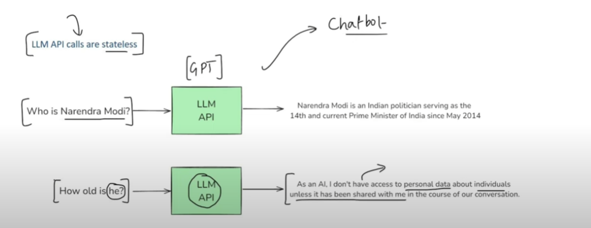

# 2025-02-19

## Topics Covered 📚
- **Langchain Components**: Core Components in Langchain (Langchain is opensource frameworks to make applications powered by LLMs)
    - **Models**: Core Interface to interact with any Ai Models. 
    Different Models has Different API behaviour with Lanchain we can communicate with different model easily. 
    Two types of Models we can communicate 
        - LLMs (Text input and Text output) 
        - Embeddng (Text input and vector Output like Semantic Search) 
    - **Prompts**: LLM->Input->Prompt ; Inputs provided to LLMs 
        - Dynamic and Reusable Prompts 
        - Role-based Prompts
        - Few Shots Prompting
    - **Chains**(important Component): we can build pipelines in Langchain; pipelines->LLM like below example
        - Chain Automatically make output of one stage to the input of another stage so we dont need to manually code for this 
                 
        
        - we can create complex pipelines with Chains
            - Parallel Chains : we can use multiple LLMs in Parallel
                    
            
            - Conditional Chains : Based on Conditions we can do Multiple Processings
                    

    - **Indexes**: Connect your applications to External Knowledge such as PDfs, Webs or databases. Indexes are made by four Components
        - **Document Loader**
        - **Text Splitter**
        - **Vector Store**
        - **Retrievers**
                
                
                
                

    - **Memory**: LLM Api calls are stateless
                
        - 

    - **Agents**: Ai Agents for Automation
        - 
        - Ai Agents has two things that chatbots dont have
            - Reasoning Capability
            - Tools (like Api etc)

    - **Resource**: [LangChain Components | LangChain Video #2 | CampusX](https://youtu.be/-xSJA8-o6Eg?si=vBxYuEgolYVOMoPp)

