# Langchain Models

## What are Models

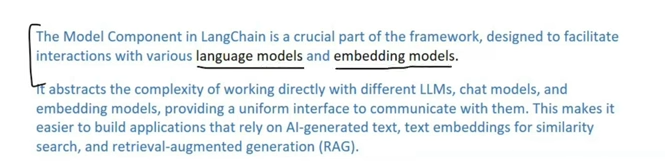

*Helps to connect with different Ai Models LLM based and Embedding Based Models*

* LLM Models: Take input as text and output as text helps to create chatbot
* Embedding Models: Take Input as text and output as embeddings/vectors helps in semantic search can create RAG based applications

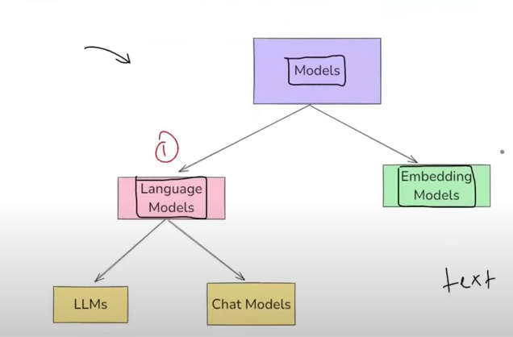

## Plan of Action
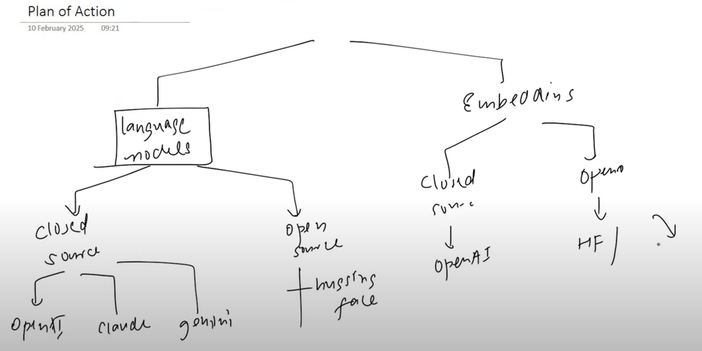

## Language Models

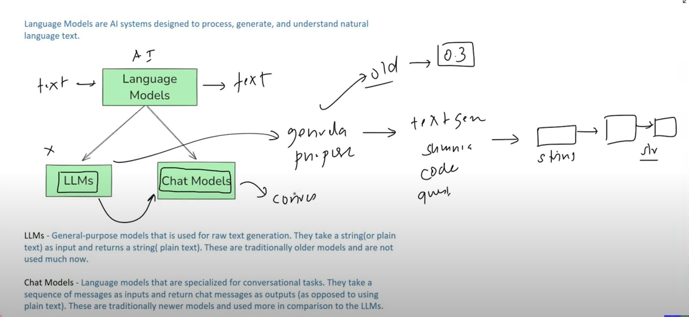

* LLM are general purpose model can be used in any NLP application can be used but in recent version of langchain its not recommended to work on LLM.

* chat models specialized models used in conversational tasks like chatbots,agents etc

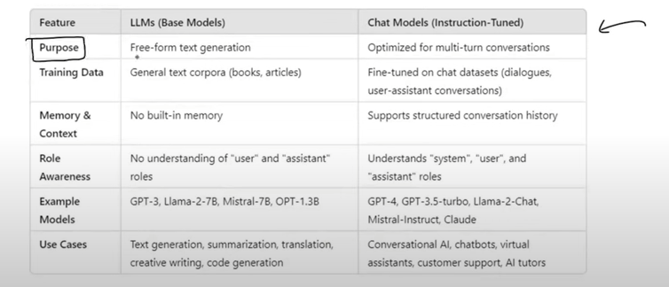

# Setup
* helps to smoothly run code 
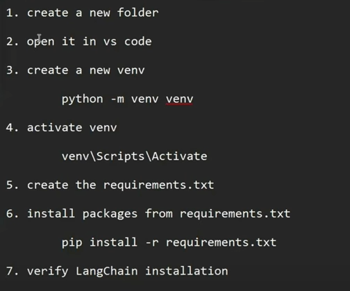

# Libraries to install

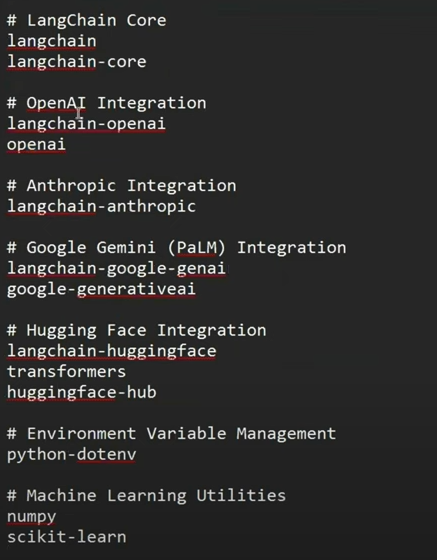
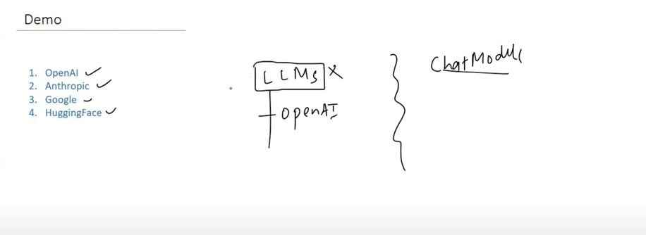

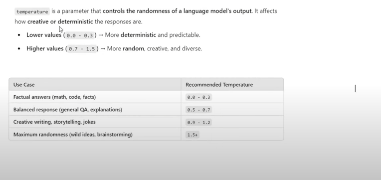

## Open source Models
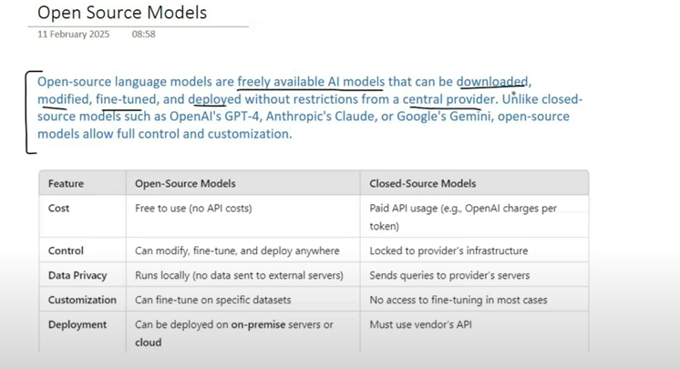
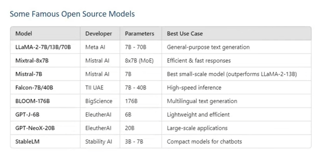

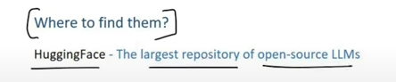

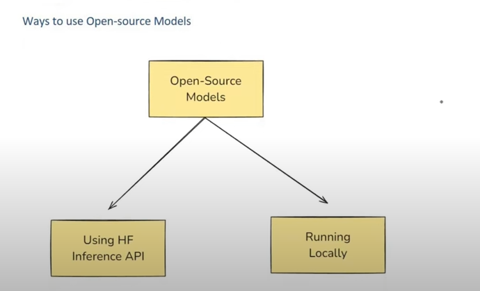
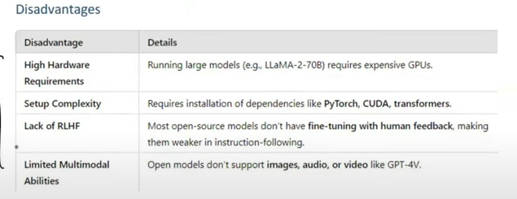

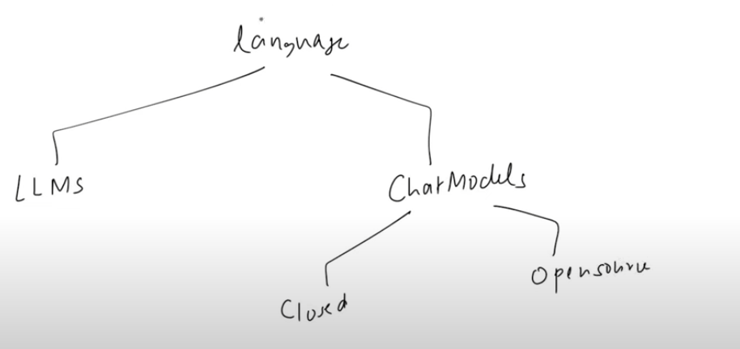

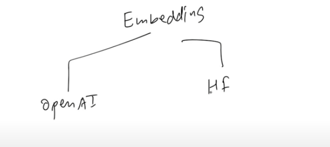

## Mini Project
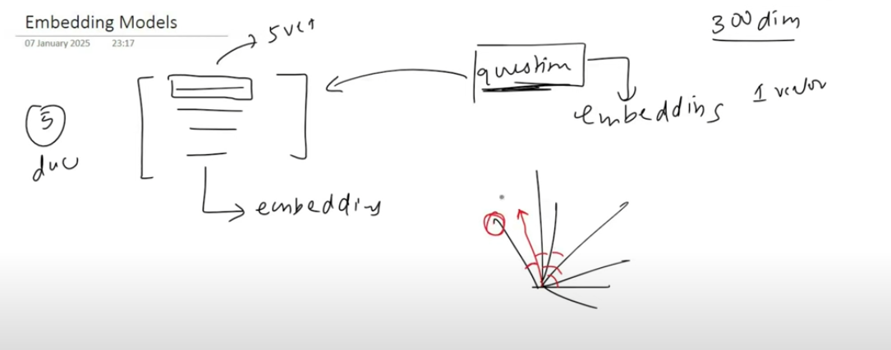

# Resource:
---
[LangChain Models | Indepth Tutorial with Code Demo | Video 3 | CampusX](https://youtu.be/HdcLE8JuMrA?si=cRzxlXsTh2aQ8TMq)
