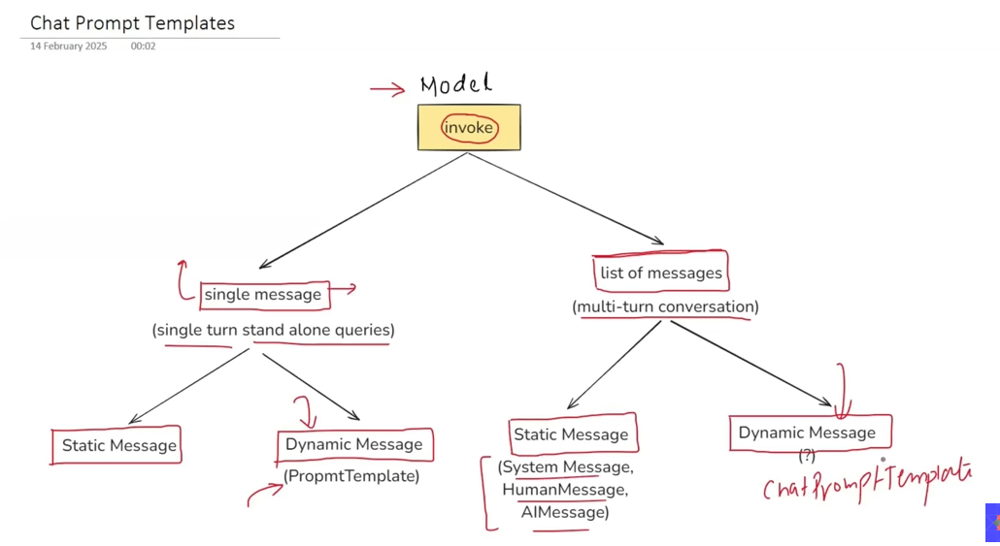

# Langchain Prompts

## For Prompts make a template

# Simple console based Chatbot

# chat prompt template 
*when work with list of messages with dynamic messages*

# Message Place Holders

put your chathistory into message placeholder for future queries

# Implementation:
---
[Prompts, Static vs Dynamic Prompt, Prompt Template, Messages, Chat Prompt Templates, Message PlaceholderPrompts
](https://github.com/talhAIE/LangChain_Learning/tree/master/Langchain_Prompts)