# Structured Output in Langchain
## Agenda
* What is Structured Output?
* Why do we need structured output?
* Ways to get structured output
* with_structured_output function
* TypedDict
* Pydantic
* JSON
* When to use?
* Important Points
* LLMs talk to database
* LLMs talk to APIS

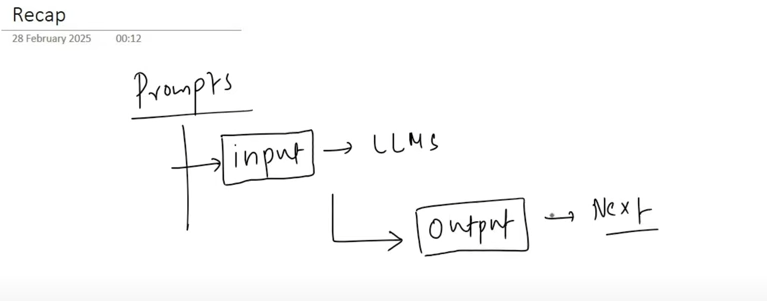

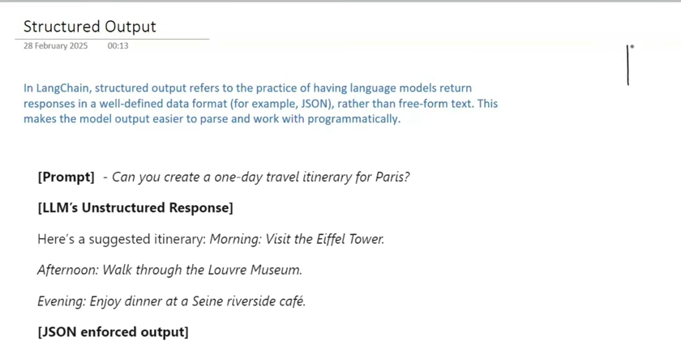

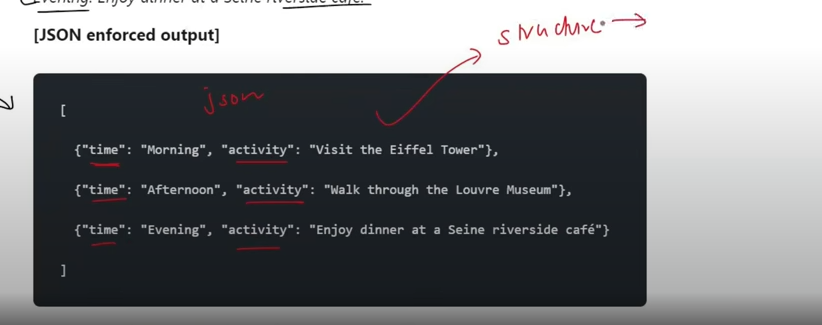

*Structure Output can easily integrate with other LLMS*

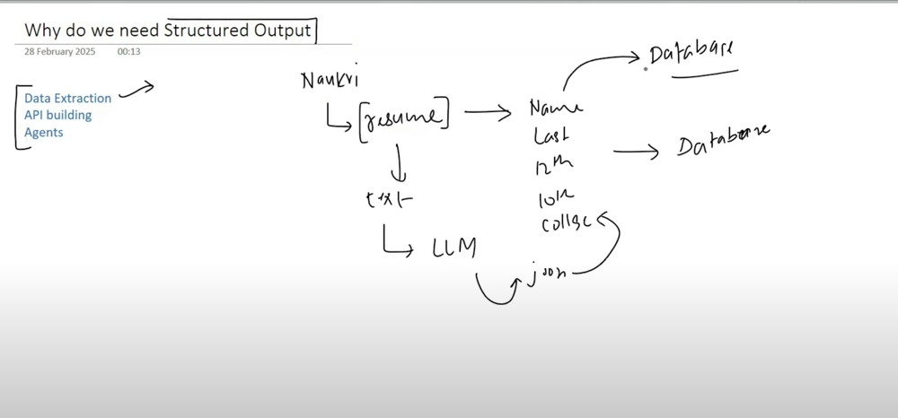

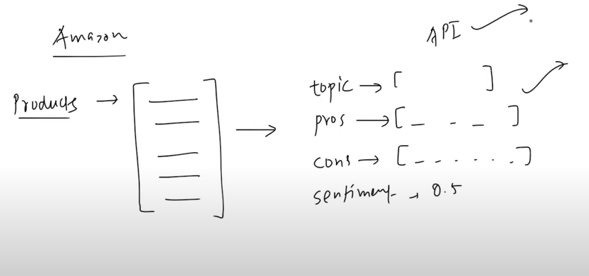

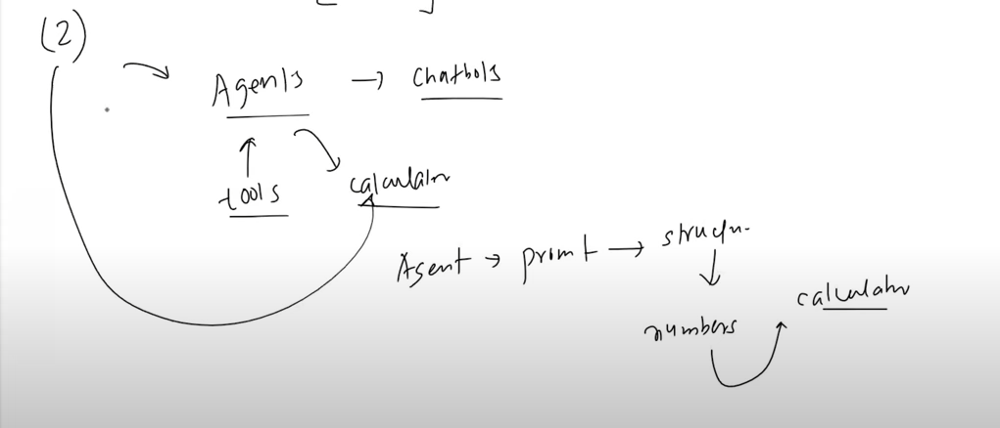

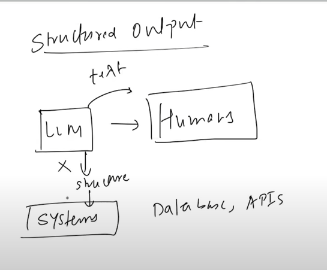

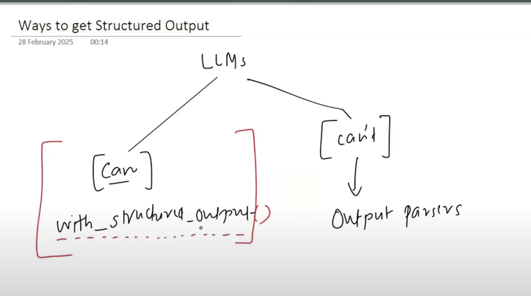

## With_Structure_Output

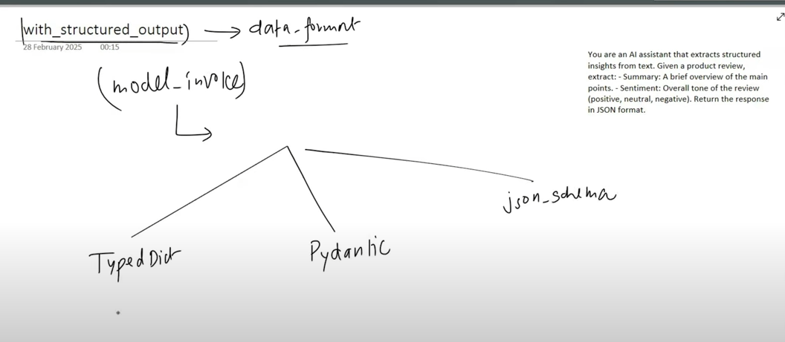

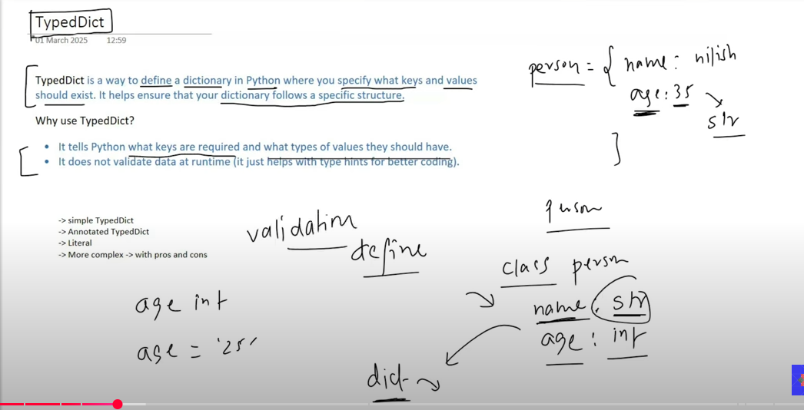

## Problem Statement

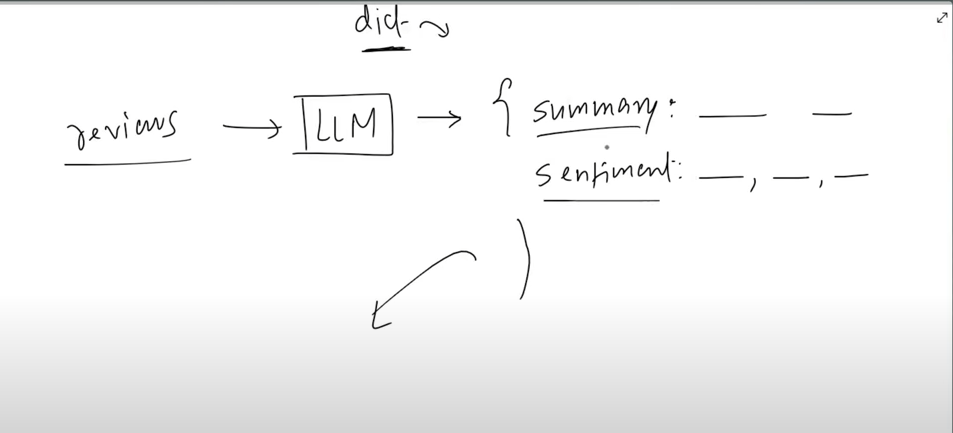

# Pydantic

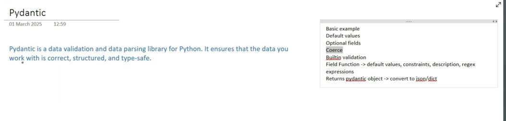

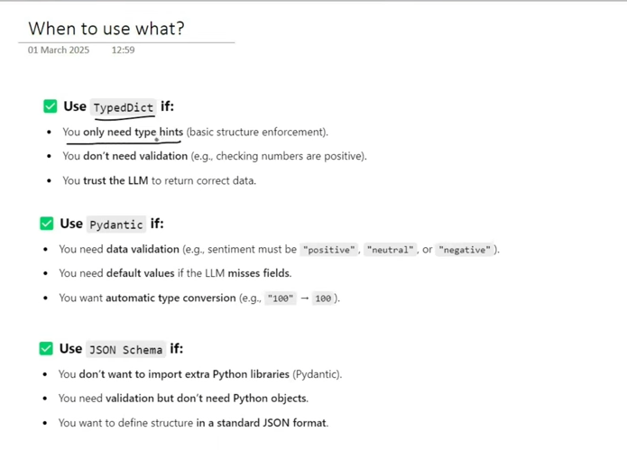
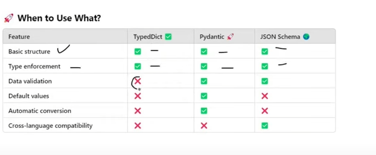

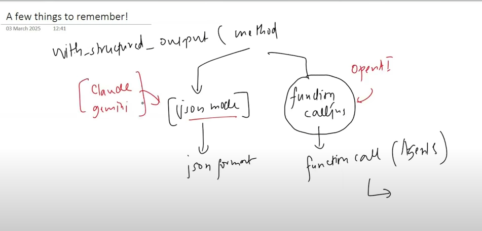