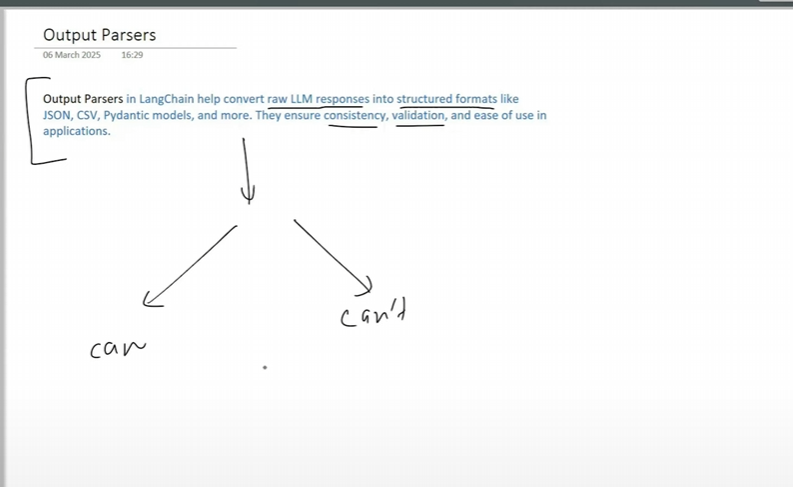
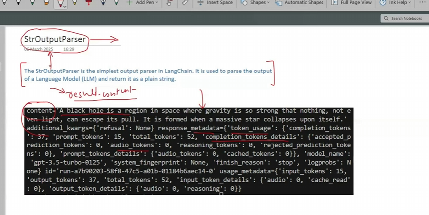
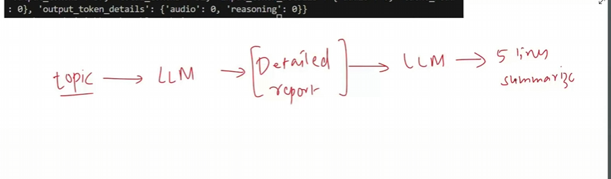
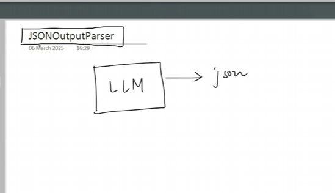
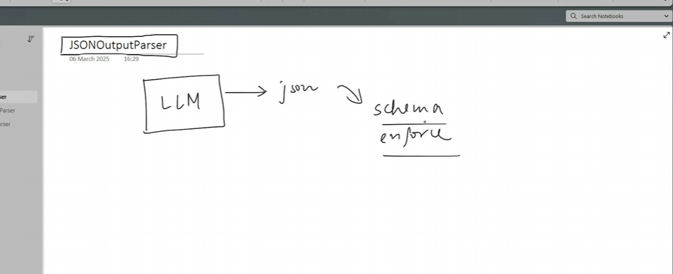
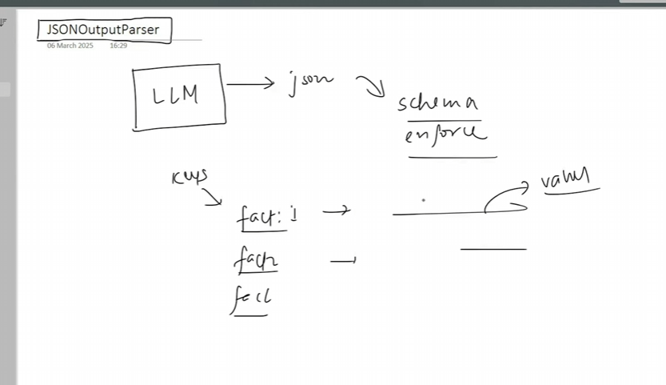
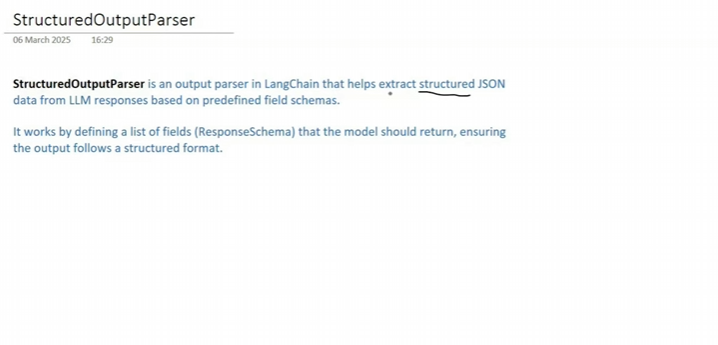
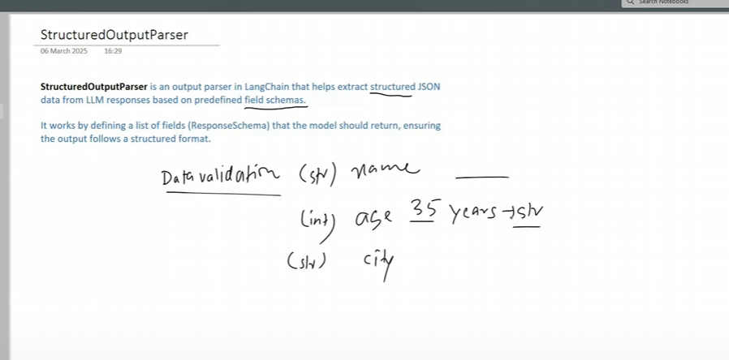
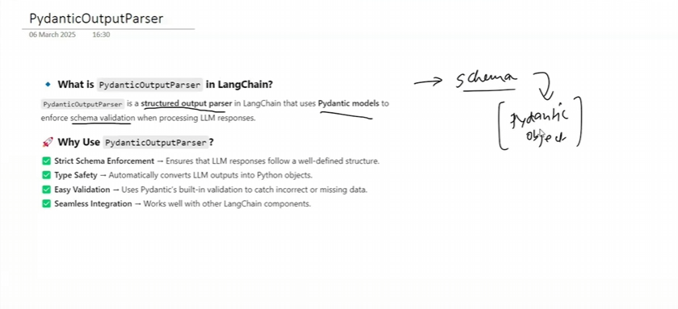
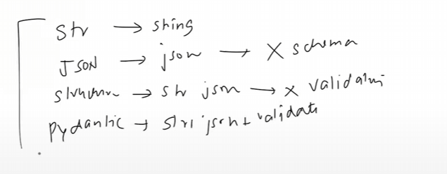

# Output Parsers

* String output Parser
* Json parser
* Structured output parser
* pydantic ouput parser
* more (but we will focus on these above)

# StrOutputParser (Simple take LLM response and convert it into string)

# JsonOutputParser

# Structured output parser

# pydantic output Parser ( we can do schema enforce and data validation)

