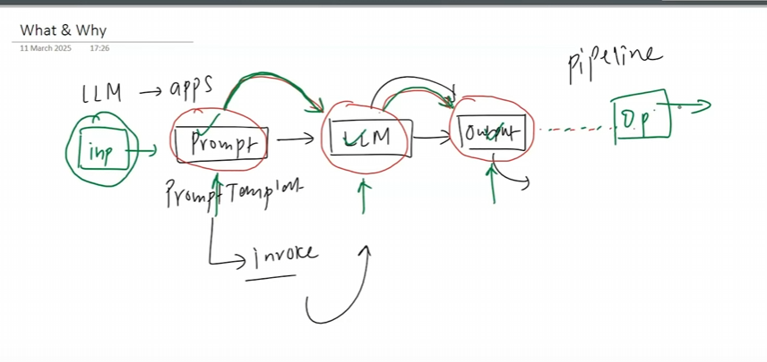

# Chain in Langchain

# what we do
* Prompt template (For input)
* LLM (invoke prompt)
* ouptut(structure output/ouput_parser)

# what are chain:
with chain we can create pipeline (connect multiple steps)

* we can use chain to create specific structural pipeline
* we can create parallel pipeline 
* we can create complex pipelines

# what we gonna do

* Sequential Chain
* Parallel Chain
* Conditional Chain

# Sequential Chain

# Parallel Chain

# Conditional Chains

