# Runnables in Langchain 
#### we can make LLM applications easily using Langchain
# Why
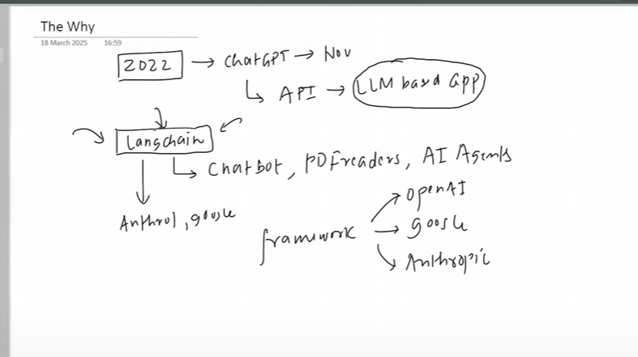
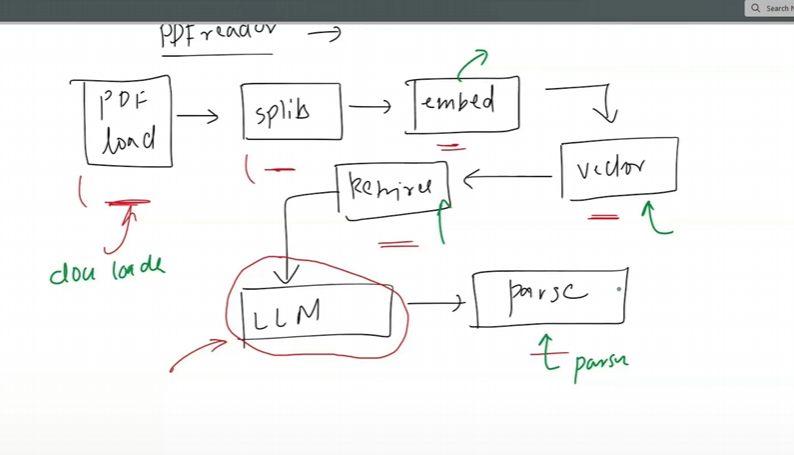

## Two example
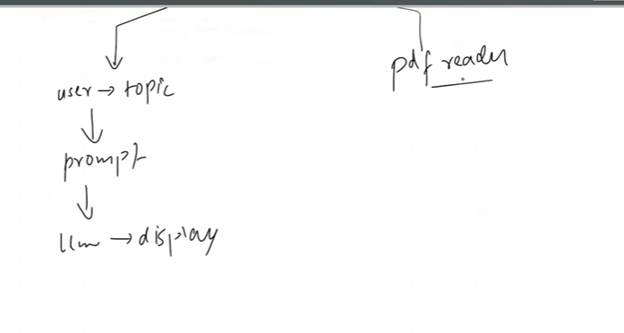

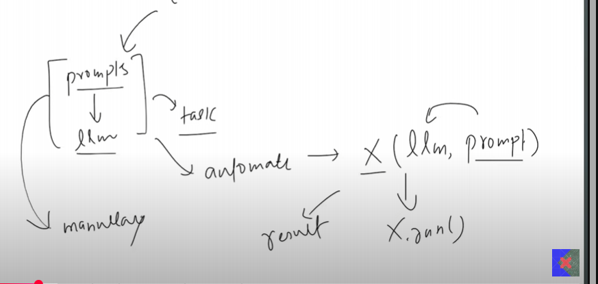

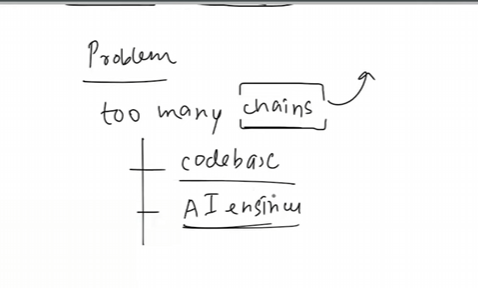

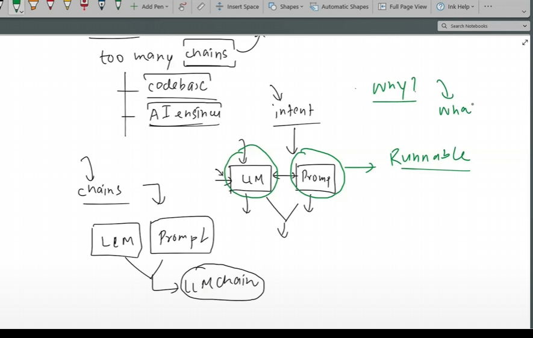

# What
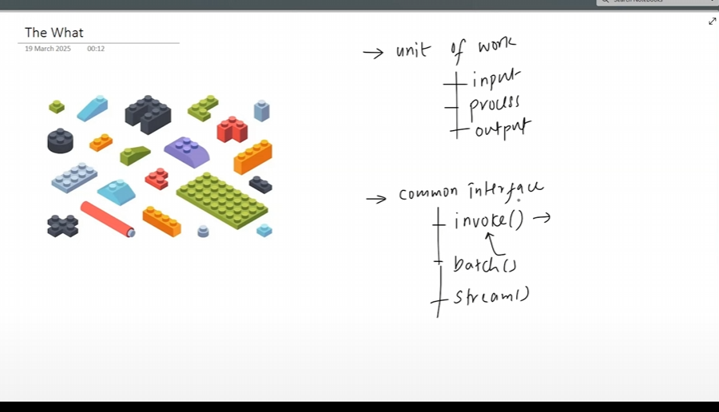

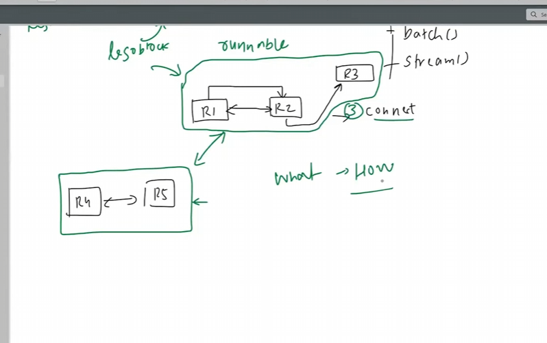

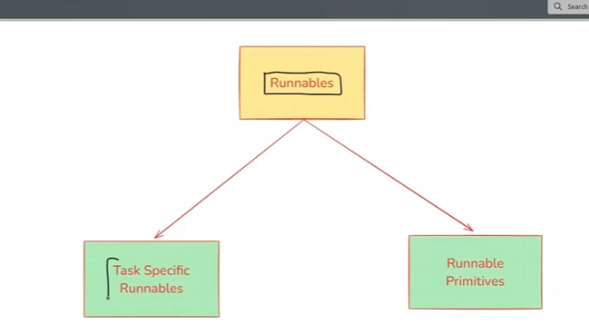

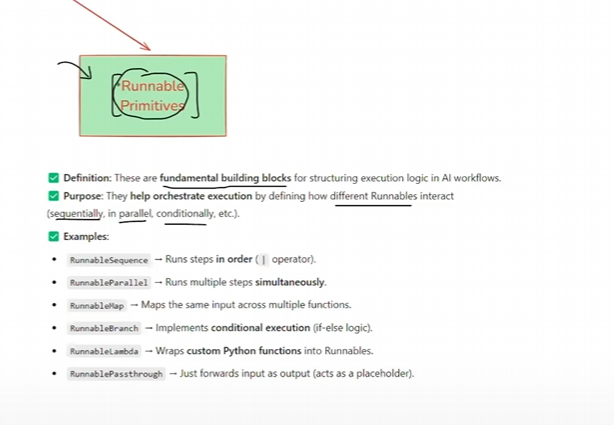

# Permitive Runables

# RunnableSequence

# RunnableParallel
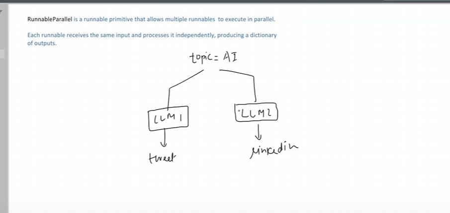

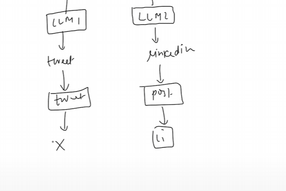

# RunnablePassthrough

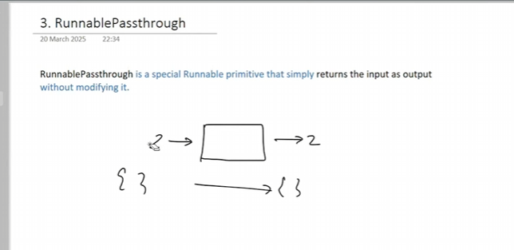

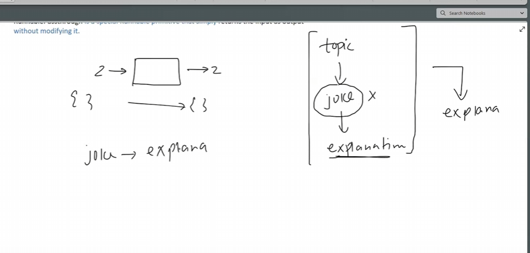

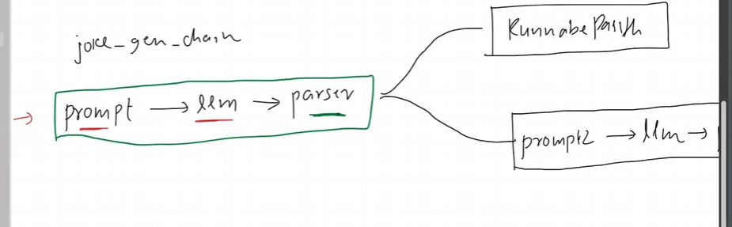

# RunnableLambda
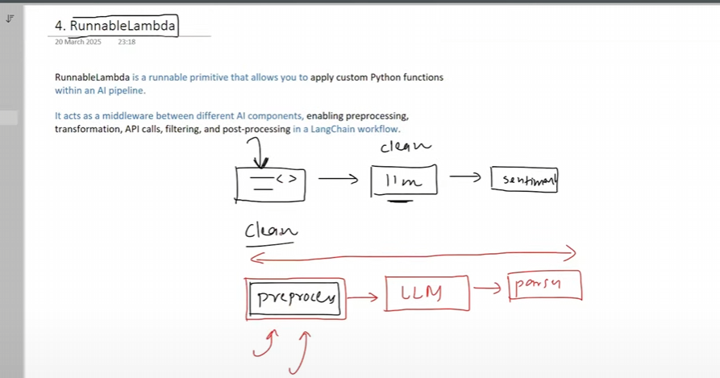
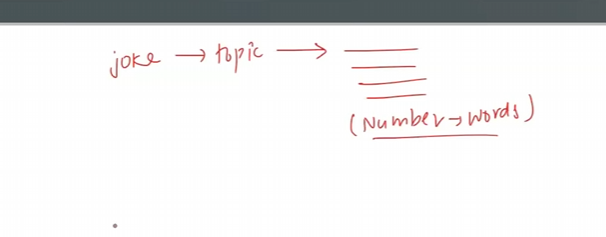
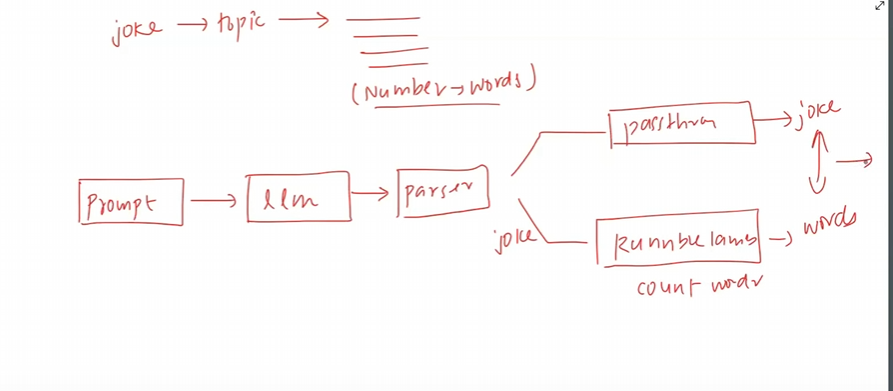

# RunnableBranch

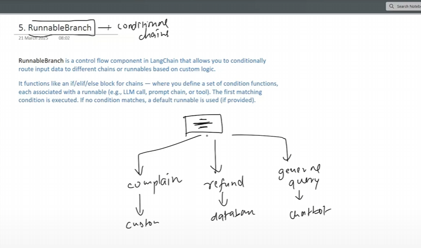
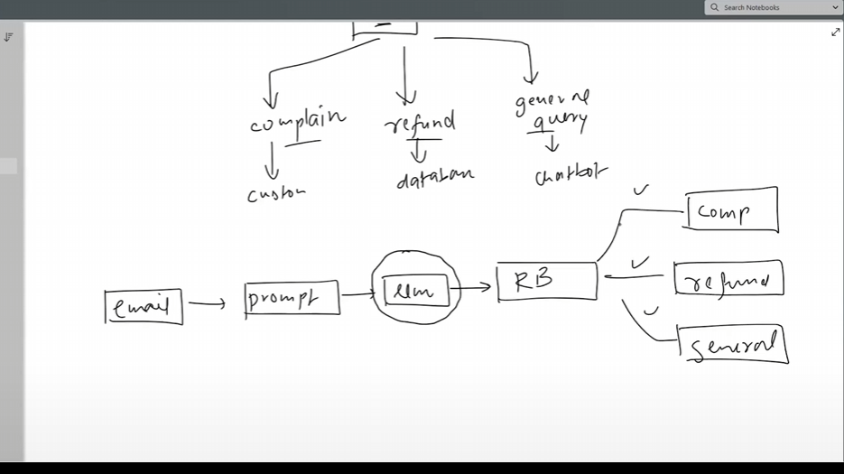

# LCEL (Langchain Expression Language) for RunnableSequence by using  | operator

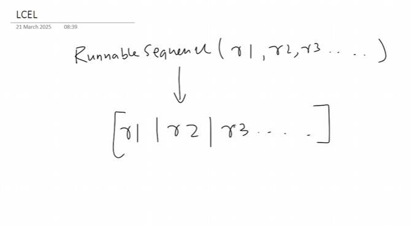

