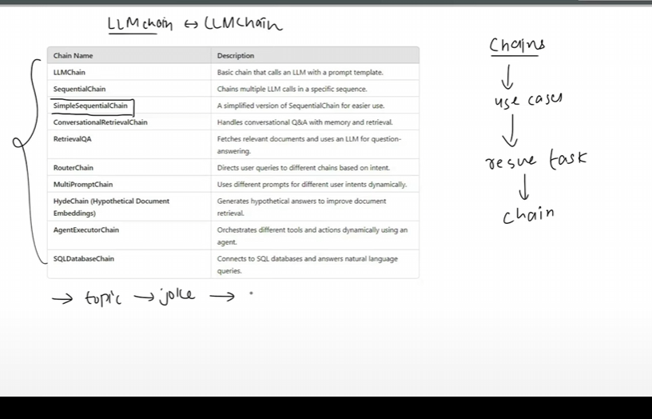
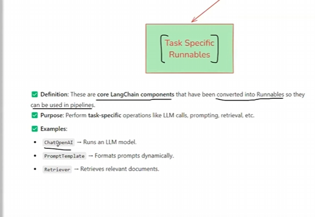
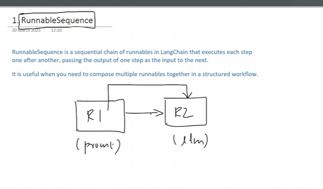

# Runnables in Langchain 
#### we can make LLM applications easily using Langchain
# Why

## Two example

# What

# Permitive Runables

# RunnableSequence

# RunnableParallel

# RunnablePassthrough

# RunnableLambda

# RunnableBranch

# LCEL (Langchain Expression Language) for RunnableSequence by using  | operator

