# Document Loader

## what we did till now
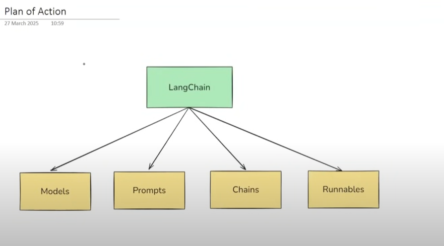

we convered almost all fundamentals of Langchain now we are going to make RAG based applications using Langchain

# RAG 
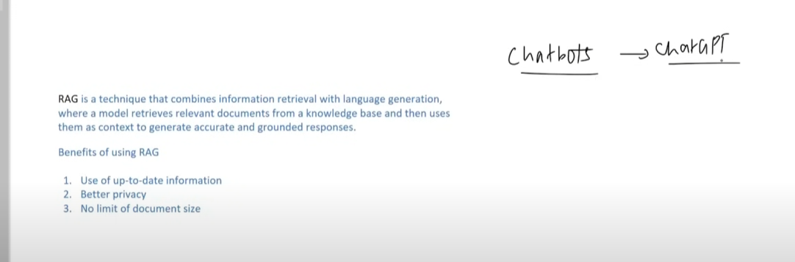
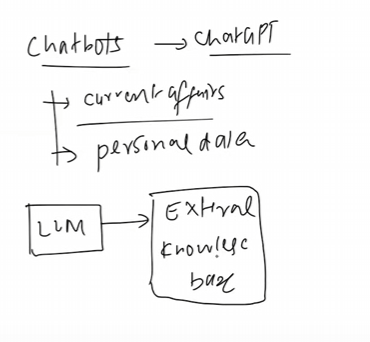

## RAG Important Components

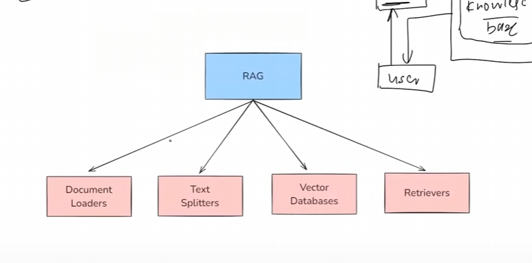

# Document Loaders

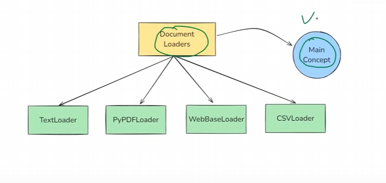

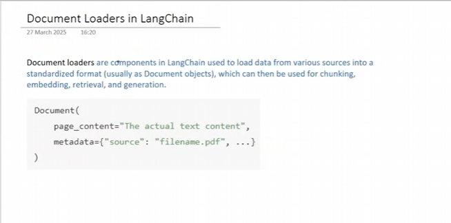

## TextLoader
use when we need to process log files, transcript, code files etc

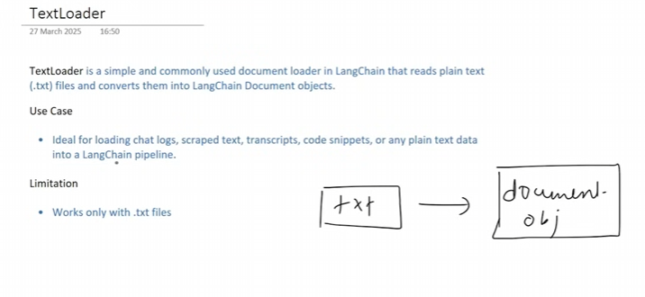

## PyPDFLoader

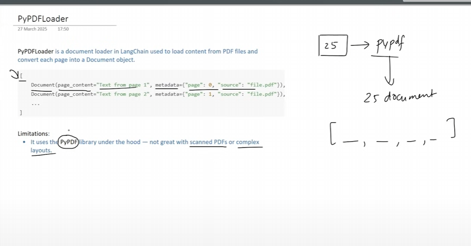

# More Pdf Loaders
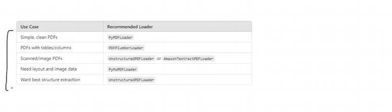

# DirectoryLoader

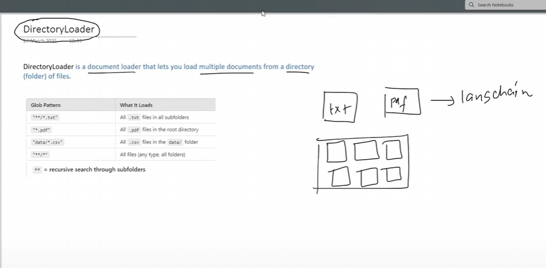

# Laod Vs Lazy Laoding
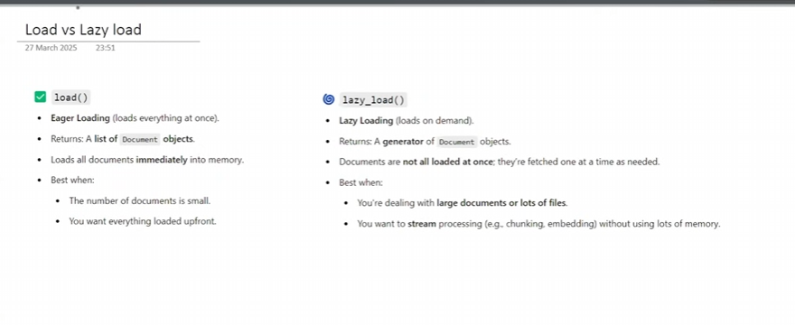

# WebBaseLoader
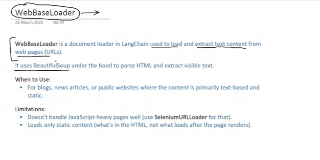

# CSVLoader
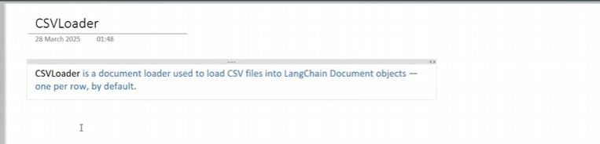

