# Text Splitting 
Documents -> small chunks

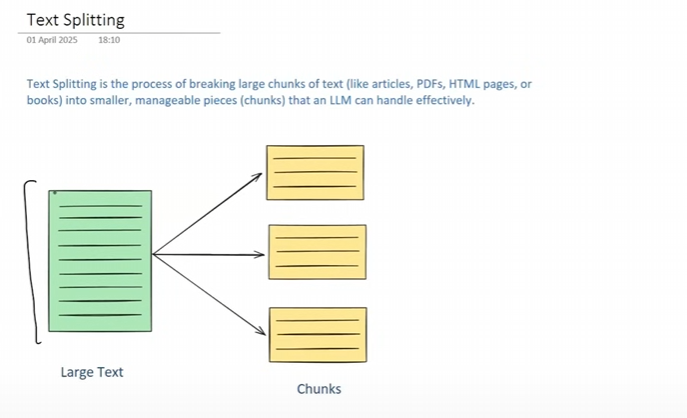

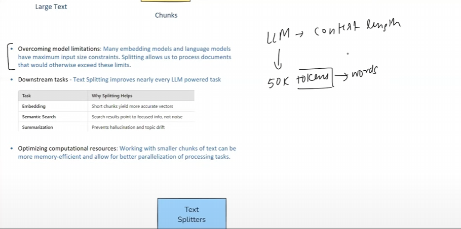

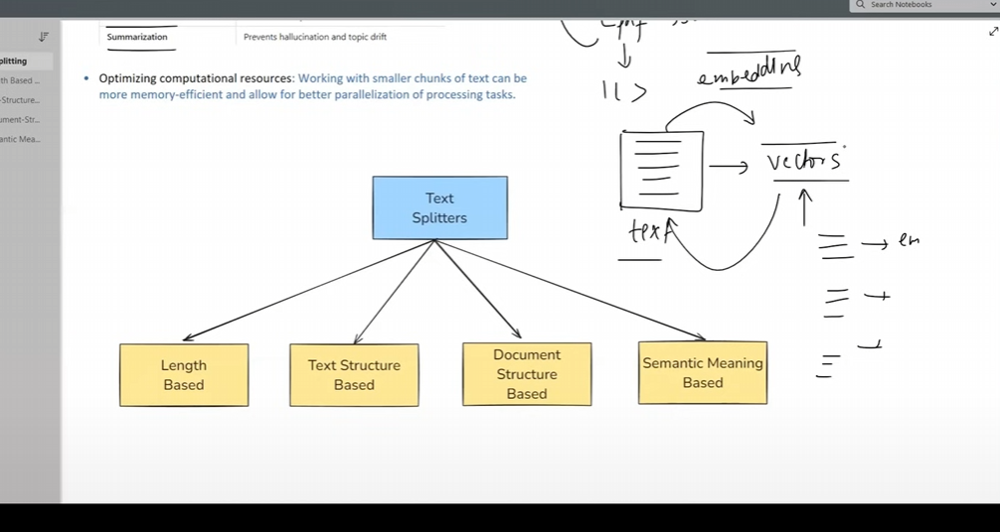

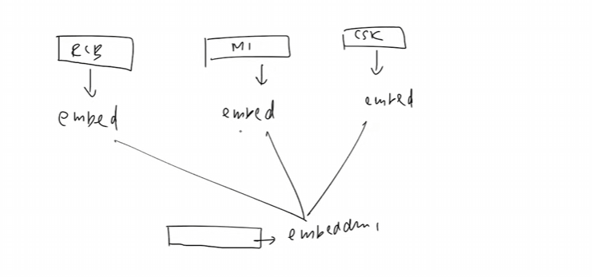

its better to do semantic searching after chunking (Text Splitting)
LLM are not good with bigger text so we need to do text splitting to get better results it can also optimize computational resources

# Length Based Text Splitting (simplest way to do text splitting)

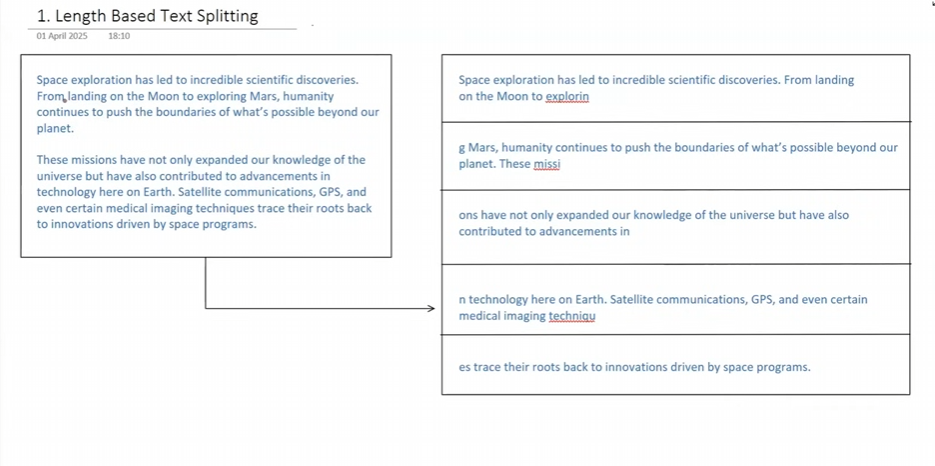

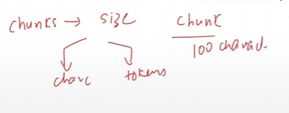

### Disadavantage
- no sentance completion 
- no gurantee of context meaning
- rare use

# Text-Structured Based (Recursive Character Text Splitter)

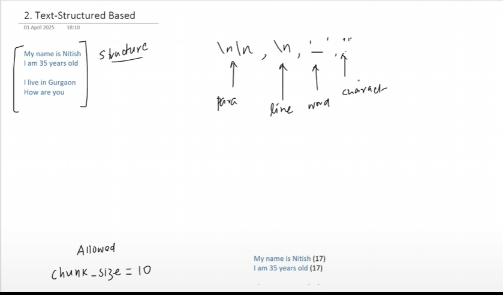
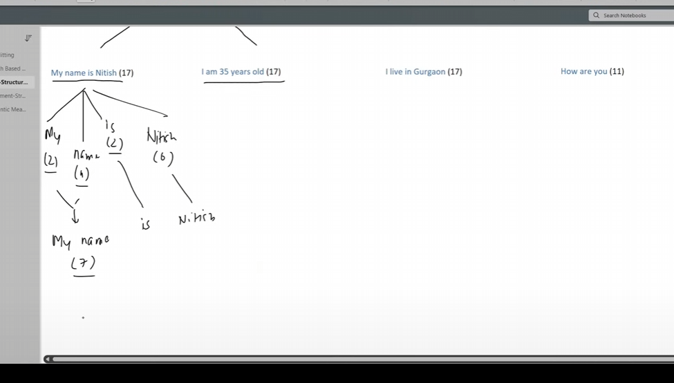
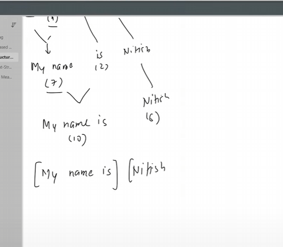
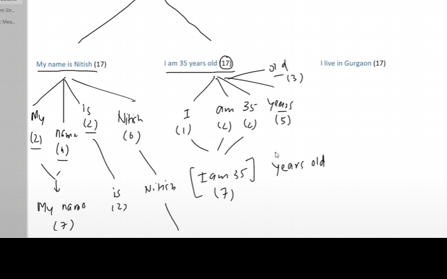
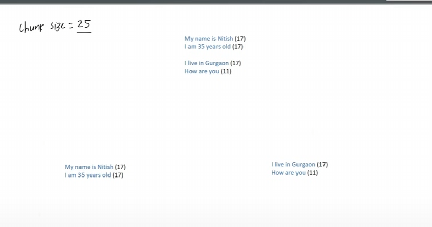

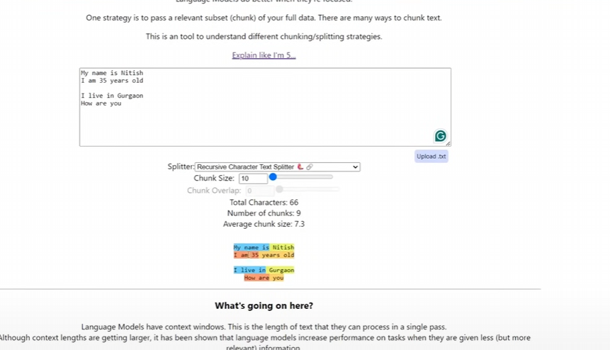

chunking steps

- \n\n -> Paragraph bases
- \n -> Line bases
- ' ' -> word bases (chunks based on space)
- . -> character base

# Document Structured Based Text Splitter
- document like coding
- document like not in plain text format
- not in proper formating
- Markdown text

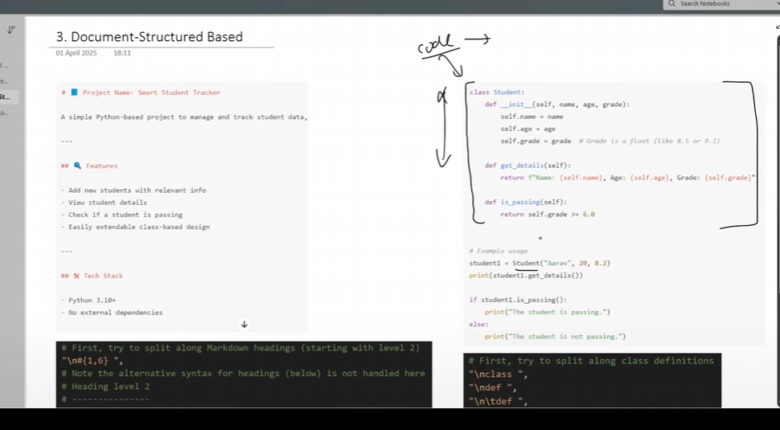

we will use RecursiveCharacterSplitter but with different separators

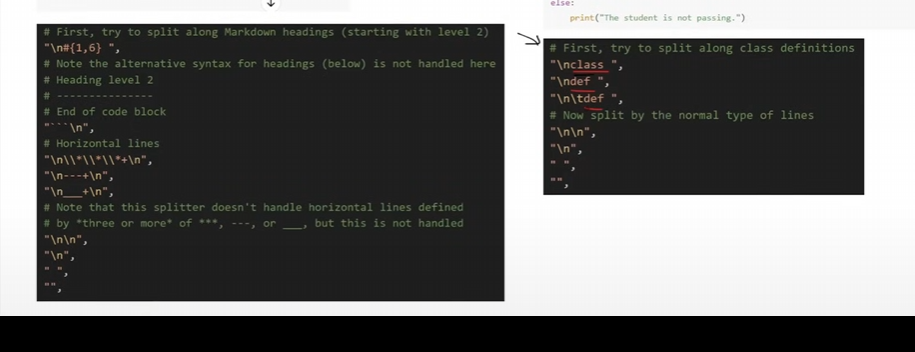

# Semantic Meaning Based
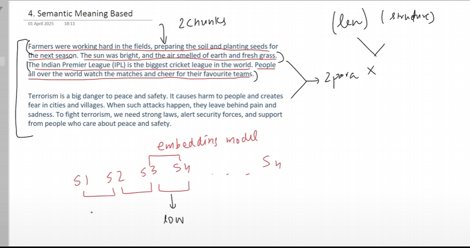

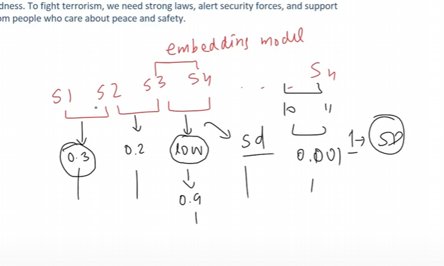

